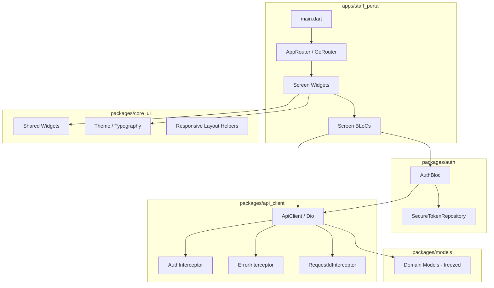
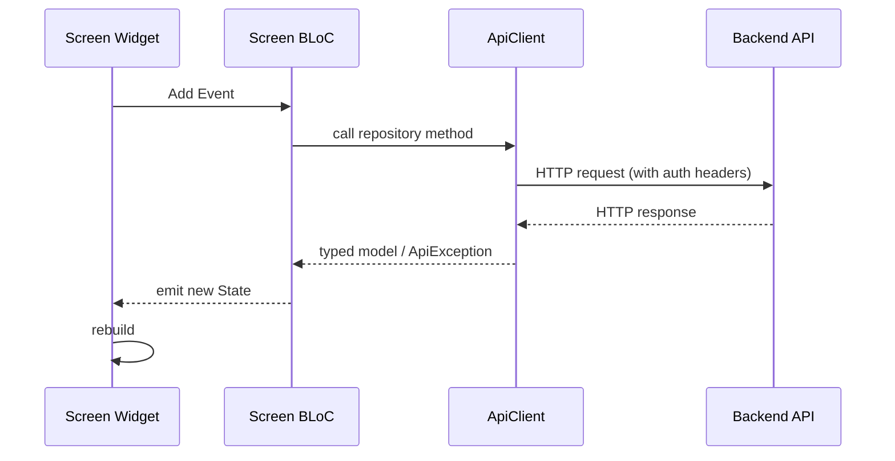
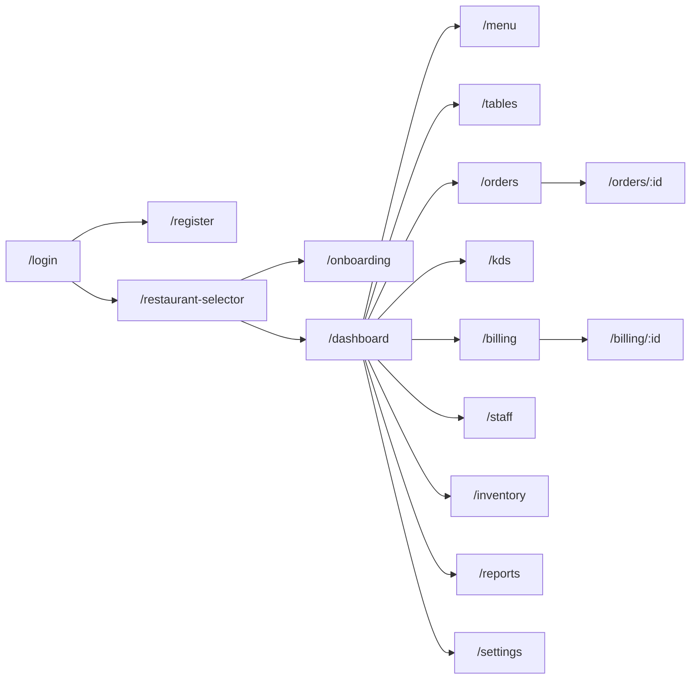
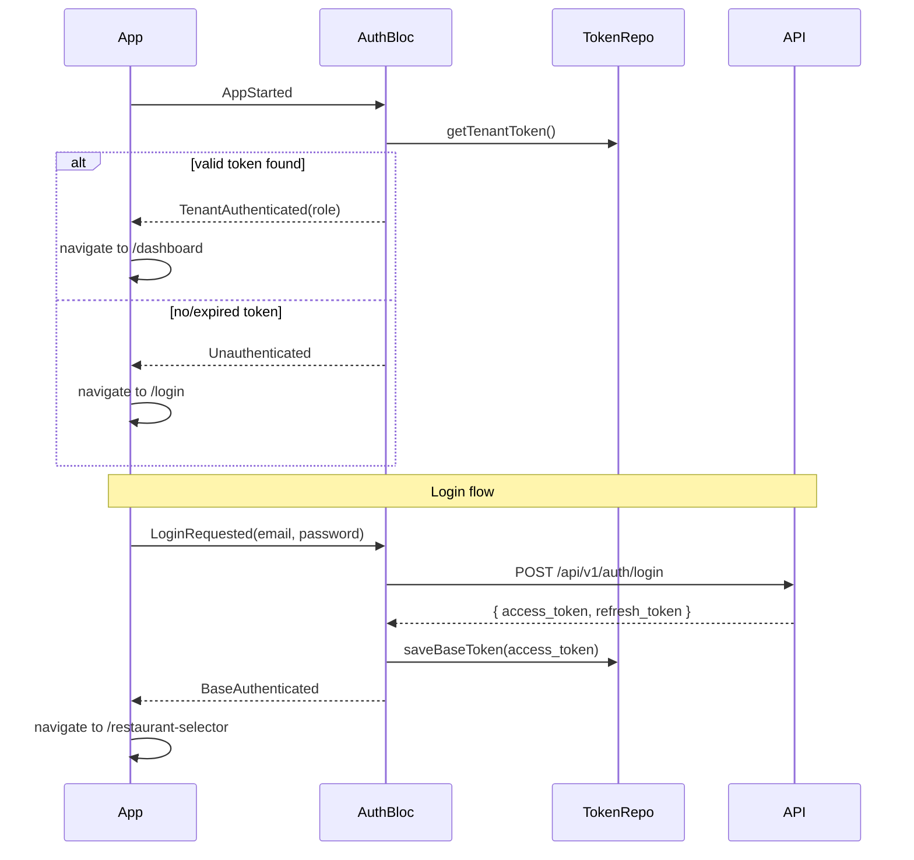
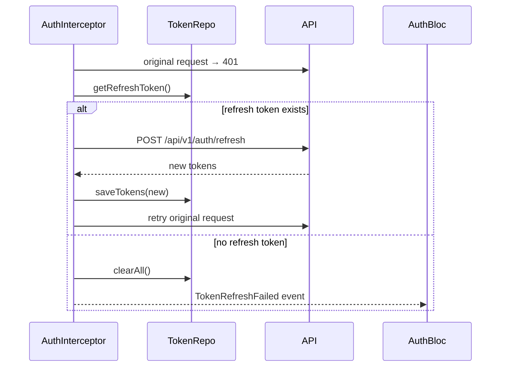
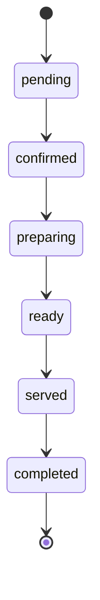
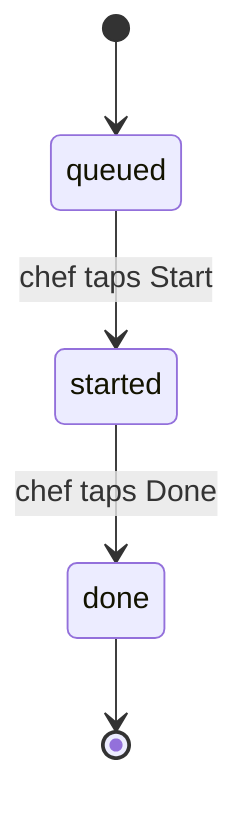
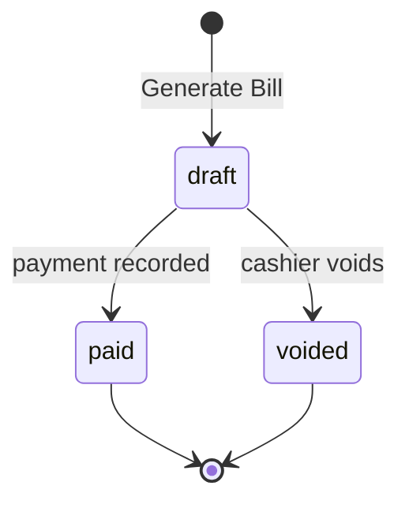

# Design Document: RMS Flutter Frontend — Staff/Owner Management Portal

## Overview

The Staff/Owner Management Portal is the first app shipped from a Flutter monorepo that will eventually house a Customer Self-Ordering App as well. The portal targets restaurant owners, managers, and operational staff (waiters, chefs, cashiers) and runs on mobile (portrait), tablet (landscape), and web (responsive).

The design is centred on a clean layered architecture: a shared **packages** layer supplies domain models, HTTP infrastructure, authentication, and core UI components, while the **apps/staff_portal** layer composes these packages into screens and navigation. State management uses Bloc throughout, navigation uses GoRouter with route guards, and data access goes through a single Dio-based `ApiClient` that handles auth headers, token refresh, error mapping, and request tracing.

Key technical choices are already confirmed:
- **State management**: Bloc (flutter_bloc)
- **Navigation**: GoRouter
- **HTTP client**: Dio
- **Models**: freezed + json_serializable
- **Token storage**: flutter_secure_storage
- **Payments**: razorpay_flutter
- **Printing**: printing package
- **Offline detection**: connectivity_plus
- **Charts**: fl_chart

---

## Architecture

### High-Level Layer Diagram



### Data Flow



### Package Dependency Graph

```
apps/staff_portal
  ├── packages/auth
  │     ├── packages/api_client
  │     └── packages/models
  ├── packages/api_client
  │     └── packages/models
  ├── packages/models
  └── packages/core_ui

apps/customer_app (stub — no shared deps yet)
```

The `apps/customer_app` stub has its own `pubspec.yaml` and no path reference back to `apps/staff_portal` or any of the shared packages yet, satisfying Req 1.3.

---

## Components and Interfaces

### 1. `packages/models`

All domain models are generated with `freezed` (immutability, `copyWith`, value equality) and `json_serializable` (serialization). The round-trip guarantee `fromJson(instance.toJson()) == instance` is a codegen property enforced by test.

**Core models:**

| Model | Key fields |
|---|---|
| `MenuItem` | id, name, categoryId, basePrice, gstRate, dietaryType, isAvailable, variants, modifierGroups, imageUrl |
| `Order` | id, orderNumber, orderType, status, tableId, items, createdAt, totalAmount |
| `Bill` | id, orderId, subtotal, gstBreakdown (list of GstSlab), total, status, payments |
| `Table` | id, tableNumber, status, currentOrderId, qrUrl |
| `Staff` | id, name, email, role, isActive |
| `KdsItem` | orderItemId, orderId, orderNumber, itemName, quantity, status, stationId, createdAt |
| `Subscription` | id, planId, planName, status, expiresAt |
| `Restaurant` | id, name, address, phone, gstNumber, logoUrl, businessHours |

**Enums:**

```dart
enum OrderStatus { pending, confirmed, preparing, ready, served, completed }
enum TableStatus { available, occupied, reserved, cleaning }
enum KdsItemStatus { queued, started, done }
enum DietaryType { veg, nonVeg, vegan, egg }
enum StaffRole { owner, manager, waiter, chef, cashier, deliveryStaff }
enum OrderType { dineIn, takeaway, delivery }
```

**Pagination wrapper:**

```dart
@freezed
class PaginatedResponse<T> with _$PaginatedResponse<T> {
  const factory PaginatedResponse({
    required List<T> data,
    required PaginationMeta pagination,
  }) = _PaginatedResponse<T>;
}

@freezed
class PaginationMeta with _$PaginationMeta {
  const factory PaginationMeta({
    required int total,
    required int page,
    required int limit,
    required int pages,
  }) = _PaginationMeta;
}
```

---

### 2. `packages/api_client`

**`ApiClient`** is the single Dio instance shared across the app. It is constructed with a base URL and three interceptors applied in order:

1. **`RequestIdInterceptor`** — adds `X-Request-ID: <UUID v4>` to every outgoing request (Req 18.8).
2. **`AuthInterceptor`** — reads the current token from `TokenRepository` and attaches `Authorization: Bearer <token>`. On HTTP 401, attempts silent token refresh via `POST /api/v1/auth/refresh` exactly once, then retries the original request. If refresh fails, emits an `unauthenticated` event consumed by `AuthBloc` (Req 18.1–18.2).
3. **`ErrorInterceptor`** — maps non-2xx responses to typed `ApiException(statusCode, errorCode, message)`. Handles 4xx (Req 18.3–18.4), 5xx (Req 18.5), and timeout (Req 18.6).

```dart
class ApiClient {
  ApiClient({required String baseUrl, required TokenRepository tokenRepo});

  Future<T> get<T>(String path, {Map<String, dynamic>? queryParams});
  Future<T> post<T>(String path, {dynamic body});
  Future<T> patch<T>(String path, {dynamic body});
  Future<T> delete<T>(String path);
}

class ApiException implements Exception {
  final int statusCode;
  final String errorCode;
  final String message;
}
```

A **global 30-second timeout** is set on the Dio `connectTimeout`, `receiveTimeout`, and `sendTimeout` (Req 18.6).

---

### 3. `packages/auth`

**`TokenRepository`** wraps `flutter_secure_storage` and exposes:

```dart
abstract class TokenRepository {
  Future<void> saveBaseToken(String token);
  Future<void> saveTenantToken(String token);
  Future<String?> getBaseToken();
  Future<String?> getTenantToken();
  Future<void> clearAll();
  bool isTenantTokenValid(); // checks exp claim
}
```

**`AuthBloc`** manages the full authentication lifecycle:

```dart
// Events
sealed class AuthEvent {}
class AppStarted extends AuthEvent {}
class LoginRequested extends AuthEvent { final String email, password; }
class RegisterRequested extends AuthEvent { ... }
class RestaurantSelected extends AuthEvent { final String restaurantId; }
class LogoutRequested extends AuthEvent {}
class TokenRefreshFailed extends AuthEvent {}
class ChangePasswordRequested extends AuthEvent { ... }

// States
sealed class AuthState {}
class AuthInitial extends AuthState {}
class AuthLoading extends AuthState {}
class Unauthenticated extends AuthState {}
class BaseAuthenticated extends AuthState {} // has Base_JWT, needs restaurant selection
class TenantAuthenticated extends AuthState { final StaffRole role; } // has Tenant_JWT
class AuthError extends AuthState { final String message; }
```

The `AuthBloc` also holds the decoded `StaffRole` from the Tenant_JWT claim, which drives all role-based UI visibility (Req 16).

---

### 4. `packages/core_ui`

**Theme:** A single `AppTheme` class exposing `ThemeData` for light mode (dark mode is out of scope for this phase). Typography scale, colour palette, and spacing constants are all defined here and consume Flutter's `TextTheme` and `ColorScheme`.

**Responsive helpers:**

```dart
class ScreenBreakpoints {
  static const double compact = 600;
  static const double medium = 1024;
}

class ResponsiveLayout extends StatelessWidget {
  final Widget compact;   // < 600 dp  → bottom nav + single col
  final Widget medium;    // 600–1023  → nav rail + two-col
  final Widget expanded;  // ≥ 1024    → drawer + master-detail
}
```

**Shared widgets:** `AppScaffold`, `ErrorStateWidget`, `RetryButton`, `LoadingSkeletonCard`, `ConfirmationDialog`, `DietaryBadge`, `StatusBadge`, `OfflineBanner`, `PaginatedListView`.

---

### 5. `apps/staff_portal` — Navigation (GoRouter)

All routes are declared in a single `AppRouter` class. Route guards are implemented via `GoRouter.redirect`.



**Route guards:**
- If no valid `Tenant_JWT` → redirect to `/login`
- If has `Base_JWT` but no `Tenant_JWT` → redirect to `/restaurant-selector`
- If role lacks permission for route → redirect to `/dashboard` with "Access Denied" message (Req 16.7–16.8)

---

### 6. Screen BLoCs — Per-Feature

Each screen (or logical feature group) has its own BLoC. BLoCs communicate with the backend exclusively through typed repository classes that delegate to `ApiClient`.

| Screen | BLoC | Repository |
|---|---|---|
| Auth | `AuthBloc` | `AuthRepository` |
| Restaurant Selector | `RestaurantBloc` | `RestaurantRepository` |
| Onboarding | `OnboardingBloc` | `OnboardingRepository` |
| Dashboard | `DashboardBloc` | `DashboardRepository` |
| Menu Categories | `MenuCategoryBloc` | `MenuRepository` |
| Menu Items | `MenuItemBloc` | `MenuRepository` |
| Tables | `TableBloc` | `TableRepository` |
| Orders | `OrderBloc` | `OrderRepository` |
| KDS | `KdsBloc` | `KdsRepository` |
| Billing/POS | `BillingBloc` | `BillingRepository` |
| Staff | `StaffBloc` | `StaffRepository` |
| Inventory | `InventoryBloc` | `InventoryRepository` |
| Reports | `ReportsBloc` | `ReportsRepository` |
| Settings | `SettingsBloc` | `SettingsRepository` |

---

### 7. Polling Architecture

Polling is managed inside BLoCs using `Stream.periodic` combined with `StreamSubscription`. The merge strategy for KDS prevents flicker by retaining existing cards until the new feed arrives.

```dart
// Inside KdsBloc
StreamSubscription? _pollSub;

void _startPolling() {
  _pollSub = Stream.periodic(const Duration(seconds: 15))
      .listen((_) => add(KdsFeedRequested()));
}
```

| Screen | Interval |
|---|---|
| KDS | 15 s |
| Orders list | 30 s |
| Dashboard | 60 s |

**Firebase FCM hook:** The `KdsBloc` exposes a public `injectFeedUpdate(List<KdsItem> items)` method. When FCM is wired up in a later phase, the FCM message handler calls this method instead of (or alongside) the poll, providing a zero-refactor upgrade path.

---

## Data Models

### Authentication Flow



### Token Refresh Flow



### Order Lifecycle State Machine



### KDS Item Lifecycle



### Bill Lifecycle



---

## Correctness Properties

*A property is a characteristic or behavior that should hold true across all valid executions of a system — essentially, a formal statement about what the system should do. Properties serve as the bridge between human-readable specifications and machine-verifiable correctness guarantees.*

### Property 1: Model Serialization Round-Trip

*For any* valid domain model instance (MenuItem, Order, Bill, Table, Staff, KdsItem, Subscription), serializing it to JSON and then deserializing from that JSON SHALL produce a value equal to the original instance.

**Validates: Requirements 1.5**

---

### Property 2: Short Password Validation

*For any* string of length 0 through 7 submitted as a new password, the App SHALL display a validation error on the password field and SHALL make no outgoing network call.

**Validates: Requirements 2.6**

---

### Property 3: Required Field Validation — No Network Call on Missing Input

*For any* form submission where one or more required fields (name, category_id, base_price, dietary_type, email, adjustment quantity) are absent or blank, the App SHALL display a field-level validation error and SHALL make no outgoing network call.

**Validates: Requirements 7.4, 12.4, 13.5**

---

### Property 4: Role-Based Navigation Invariant

*For any* authenticated session with a given `StaffRole`, the set of visible navigation items SHALL be exactly the role's permitted set as defined in Req 16.3–16.6, and any attempt to navigate to a restricted route SHALL redirect to `/dashboard`.

**Validates: Requirements 16.3, 16.4, 16.5, 16.6, 16.7**

---

### Property 5: State Revert on API Failure

*For any* optimistic UI action (menu item availability toggle, KDS item status update) that receives an API error response, the state displayed in the UI SHALL revert to its value prior to the action, and a non-empty error message SHALL be shown.

**Validates: Requirements 7.7, 10.5**

---

### Property 6: Offline Write Suppression

*For any* write action (form submission, status transition, toggle) attempted while the connectivity state is offline, the action SHALL not result in any outgoing network request and SHALL display an "internet connection required" message.

**Validates: Requirements 19.2, 19.4**

---

### Property 7: Pagination Completeness

*For any* sequence of paginated responses for the same query, the total item count across all pages SHALL equal the `pagination.total` value returned by the first page response, and no additional requests SHALL be made after the last page is reached.

**Validates: Requirements 9.1, 9.3, 9.4**

---

### Property 8: KDS Elapsed-Time Overdue Invariant

*For any* KDS item card, if and only if the elapsed time since order creation exceeds 10 minutes, the card SHALL display both a red border and an overdue label simultaneously; neither element SHALL appear without the other, and both SHALL disappear together if the elapsed time drops back below the threshold.

**Validates: Requirements 10.7**

---

### Property 9: Modifier Group Validation Invariant

*For any* modifier group configuration with integer values `min_select` and `max_select`, the group SHALL be saveable if and only if `max_select >= min_select`; any configuration where `max_select < min_select` SHALL be blocked with a validation error before any network call.

**Validates: Requirements 7.10**

---

### Property 10: Bill Split Total Invariant

*For any* split bill configuration submitted to the split endpoint, the sum of all resulting sub-bill totals SHALL equal the original bill total; any configuration whose parts do not sum to the original total SHALL be rejected with a validation error before submission.

**Validates: Requirements 11.8**

---

### Property 11: Payment Underpayment Rejection

*For any* payment submission where the entered amount is strictly less than the outstanding bill total and no split is in progress, the App SHALL display a validation error and SHALL not submit the payment request.

**Validates: Requirements 11.6**

---

### Property 12: Low-Stock Ordering Invariant

*For any* set of ingredients retrieved from the API, every ingredient whose current stock level is below its reorder threshold SHALL appear in the list before all ingredients that are at or above their reorder threshold.

**Validates: Requirements 13.3**

---

### Property 13: Request Tracing Header

*For any* outgoing HTTP request made by the ApiClient, the request SHALL contain an `X-Request-ID` header whose value is a valid UUID v4 string, and no two concurrent requests SHALL share the same value.

**Validates: Requirements 18.8**

---

### Property 14: Responsive Layout Breakpoint Consistency

*For any* screen width value, the navigation component rendered (bottom nav bar / nav rail / side drawer) SHALL correspond exactly to the breakpoint bucket that contains that width value, with no gap or overlap between buckets.

**Validates: Requirements 17.1, 17.2, 17.3**

---

### Property 15: Form Focus on Validation Failure

*For any* form submission that fails validation on one or more fields, the platform focus SHALL be moved to the first field with a validation error before any other UI update, regardless of which fields failed or how many fields the form contains.

**Validates: Requirements 20.4**

---

## Error Handling

### Error Taxonomy

| Category | Condition | User-Visible Outcome |
|---|---|---|
| Validation | Missing/invalid field values | Inline field error, no network call |
| Auth (401 + refresh OK) | Access token expired | Silent refresh + retry; user unaffected |
| Auth (401 + refresh fail) | Refresh token invalid/absent | Tokens cleared, redirect to Login |
| Client error (4xx ≠ 401) | Bad request, not found, conflict | Snackbar with server `message` for ≥ 4 s |
| Client error (no message) | 4xx with no `message` field | Snackbar "An error occurred. Please try again." for ≥ 4 s |
| Server error (5xx) | Backend failure | Snackbar "Server error, please try again" for ≥ 4 s |
| Timeout | No response in 30 s | "Request timed out" message + retry action |
| Offline | No network | Persistent offline banner, write actions disabled |
| Role | Restricted route accessed | Redirect to Dashboard + "Access Denied" message |

### Inline vs. Snackbar Errors

- **Inline errors** are used for form validation (field-level) and for persistent page-level failures where a retry button is needed (e.g., failed list load).
- **Snackbar errors** are used for transient action failures (status updates, toggles, deletions) where the user stays on the same screen.
- KDS item update failures use a **3-second auto-dismissing snackbar** (Req 10.5).
- All other action snackbars stay visible for **at least 4 seconds** (Req 18.3–18.5).

### Token Refresh Idempotency

The `AuthInterceptor` uses a lock (`Mutex` or equivalent) to ensure concurrent requests that all receive 401 do not each independently attempt a refresh. Only the first 401 triggers the refresh; the others queue and reuse the new token.

### Form Focus Management on Validation Error

When a form fails validation, focus is moved programmatically to the first erring field via `FocusNode.requestFocus()` before any other UI update (Req 20.4). This is enforced in a shared `FormValidator.submitAndFocus()` helper in `core_ui`.

---

## Testing Strategy

### Overview

The testing approach uses two complementary layers:
1. **Unit + Widget tests** — verify specific examples, edge cases, error conditions, and UI rendering.
2. **Property-based tests** — verify universal properties across generated input spaces, using the `dart_test` framework extended with the [`fast_check`](https://pub.dev/packages/fast_check) package (or equivalent Dart PBT library).

### Unit and Widget Tests

| Area | Test focus |
|---|---|
| Model serialization | `fromJson(toJson(x)) == x` for each model |
| Form validators | Required fields, min-length, email format, numeric range |
| AuthBloc | State transitions for all auth events |
| ApiClient interceptors | 401 refresh flow, X-Request-ID header, error mapping |
| Role-based visibility | Correct nav items shown/hidden per role |
| KDS elapsed time label | Red border + overdue label appear together above 10 min |
| Responsive layouts | Correct nav widget rendered at 599 dp, 600 dp, 1023 dp, 1024 dp |
| Offline banner | Banner appears/disappears with connectivity changes |

### Property-Based Tests

Each property test runs a minimum of **100 iterations**. Tests are tagged with the design property they validate.

| Property | Generator inputs | Assertion |
|---|---|---|
| **Property 1**: Model round-trip | Arbitrary valid model instances | `fromJson(instance.toJson()) == instance` |
| **Property 2**: Short password rejection | Strings of length 0–7 | Validation error shown, no HTTP call |
| **Property 3**: Required field validation | Partial form inputs with missing fields | Validation error shown per missing field, no HTTP call |
| **Property 4**: Role navigation | Arbitrary `StaffRole` values | Nav item set matches role spec exactly; restricted routes redirect |
| **Property 5**: State revert on API failure | Arbitrary item states + error responses | UI state reverts to prior value after error |
| **Property 6**: Offline suppression | Arbitrary write actions while offline | No HTTP request emitted, tooltip shown |
| **Property 7**: Pagination completeness | Arbitrary paginated response sets | Sum of page item counts == `pagination.total` |
| **Property 8**: KDS overdue invariant | Arbitrary elapsed durations | Red border AND overdue label appear together iff elapsed > 10 min |
| **Property 9**: Modifier validation | Arbitrary (min_select, max_select) pairs | Blocked iff max < min |
| **Property 10**: Split completeness | Arbitrary bill totals + split configs | Rejected iff sum of parts != total |
| **Property 11**: Payment underpayment | Arbitrary (amount, total) pairs where amount < total | Validation error shown, no HTTP call |
| **Property 12**: Low-stock ordering | Arbitrary ingredient lists with varying stock/threshold | All below-threshold items precede all at-or-above-threshold items |
| **Property 13**: Request tracing header | Arbitrary API calls | X-Request-ID present and is valid UUID v4 on every request |
| **Property 14**: Breakpoint consistency | Arbitrary screen widths | Nav widget type matches the correct breakpoint bucket |
| **Property 15**: Form focus on error | Arbitrary forms with errors on varying field positions | Focus on first erring field before any other UI update |

**Tag format:** `// Feature: rms-flutter-frontend, Property N: <property_text>`

### Integration Tests

- Full auth flow: register → login → select restaurant → reach dashboard
- KDS polling: verify feed merges without removing existing cards
- Token refresh: simulate 401 mid-flight, verify transparent retry
- Print flow: verify `printing` package receives a valid PDF document object
- Razorpay: verify plugin is invoked with correct order parameters (mock plugin)

### Test Configuration

```dart
// pubspec.yaml (root)
dev_dependencies:
  fast_check: ^0.x.x   # PBT library
  mocktail: ^0.x.x
  bloc_test: ^9.x.x
  flutter_test:
    sdk: flutter
```

Each PBT test sets `iterations: 100` minimum via the library's configuration API.

---

*Design document for rms-flutter-frontend Staff/Owner Management Portal. Review and approve before proceeding to task generation.*
